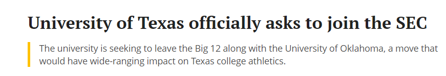
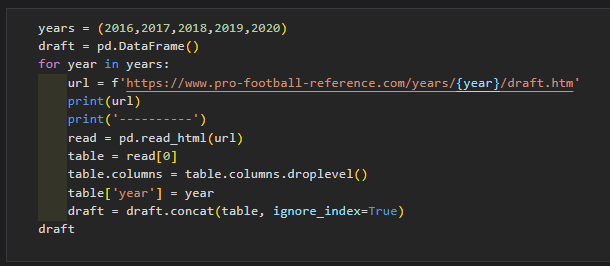
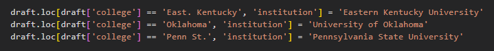
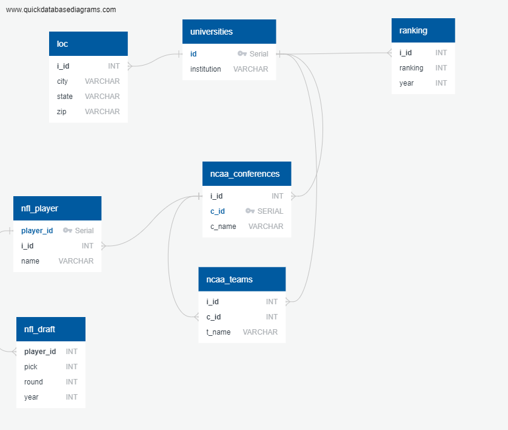
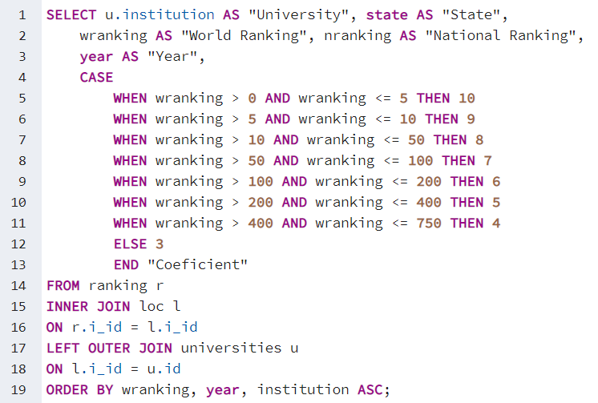

# UT College Football

On July 2021, University of Texas announced that is leaving Big 12 Conference and officially [asked to join SEC](https://www.texastribune.org/2021/07/26/university-texas-big-12/) starting July 2025.

SEC is one the best conferences for college football, so that moves seems like a move to make a better football team, but, is that true? Let's see:

* See Tableau Public Story [UT CollegeFootball Story](https://public.tableau.com/app/profile/luis.ruiz.lopez/viz/UTCollegeFootballStory/Presentation?publish=yes)

### Academics

Analysis of the [ARWU](http://archive.shanghairanking.com/ARWU2020.html) (Academic Ranking of World Universities) of University of Shanghai.
I Choose ARWU ranking because is the most accepted ranking for universities in the world. I'm aware there are more rankings for universities in the US, but this seems like an acceptable choice. There are also rankings by subjects that could be use.

* Conclusions: 

    - UT-Austin is ranked the best university in Texas, followed by Rice University and Baylor College of Medicine. 8 Universities from Texas appeared in the ranking from 2016 to 2015.

    - Texas is the first state along with California with a count of 25 appearances in the five years period but the coeficient is lower because universities from Texas appears in a lower ranking. 

    - Illinois with 20 appearances and a coeficient equal than Texas and Massachusets with 23 appearances and coeficient similar to Texas deserve a mencion. 

    So we can conclude that in according to ARWU ranking for the years 2016 to 2020, California is the holds the best position followed by Texas. And, inside Texas, UT-Austin is the best univeristy to study.

### College Football

With that being said, let see how is college football for the UT Longhorns. 

One the most important objetives of college sports is to help players to develop their skills and continue their career as a professional sportman. In the Football case, to analyze the compliance with this objetive one the best options is to analyze how many players from the university team is being picked in each year draft. The hypothesis is that the best is the team, the more players are going to be picked from the team in the draft. 

The second hypothesis is that the best is the academic part of the university, the more and better players would want to join the university team. 

As we can see in the third slide, only 12 players from UT were drafted in the five year period. University of Alabama holds the first position in this ranking with 48 players being drafted in the five years period. 

Regarding Texas universities, Texas A&M holds the best position in the five years period. Both, Texas A&M and University of Alabama plays in the SEC. 

 - With Texas A&M and University of Alabama not appearing in ARWU in the five years period, we can conclude that my second hypothesis is completely false. There is no a correlation between academic quality and football performance. 

### Conference

One thing a team can do to improve is switch conferences. If you compete against better teams, the games are going to be better, the team is going to gain fans and more high school players would want to play for you. Also, with more people following the team, the players are going to have more exposure to NFL teams and more possibilities to be drafted. 

That could be one of the reasons that moved UT to ask to join SEC. 

- In the five year period, SEC holds the first position in number of players drafted. Big 12 a discrete 5th position.
- For each year, SEC has been the conference with more players drafted.

* Qualitative Analisis. As I've done with the ARWU to analyze the states, I think it is importante to know not only how many players are drafted for each conference, but also in with pick number where choosen. 

### Conclusion.

- Regarding Academics, UT holds a meritory raking 41st and 30th in Economics. UT is the best University of Texas as well as Texas is the second best state to study in the US.

- However, There is no correlation between academic quality and football performance. 

- UT is the third Texas universities in number of picks on NFL draft for 2016-2020 period.

- Big 12 is the fifth in number of picks for the five years period.

- SEC is the first conference in number of picks for the five year period.

## If finally, UT joins SEC is going to have more chances to improve, more players would want to play in the team and the fan base is going to grow.

### And, that is very good, because we all know that football is big deal in the Lone Star State, So the better is our football team, more options to increase the fundraise we are going to have. More funds means more resources and more resources mean a better university.  

 
 
 
 

# Methodology:

### ETL
* Extract:
    - Sources:
    [ARWU](http://archive.shanghairanking.com/ARWU2020.html)
    [Pro football reference](https://www.pro-football-reference.com/years/2020/draft.htm)
    [National Center for Educational Statistics](https://nces.ed.gov/datatools/index.asp?DataToolSectionID=1)
    [The University of Texas Systeam](https://data.utsystem.edu/)
    - Extract information using Pandas.

* Transform

    - Transform columns, data types, add id's, check the institutions names to make sure everything match. 
    - Pandas.
     

* Load

    - Make ERD (Entity Relationship Diagram) to build a SQL Database. I use [QuickDatabaseDiagram](https://www.quickdatabasediagrams.com/)
 

    - Take in consideration slow moving dimension to design the database.

    - Export and check the SQL script to create the tables in a previously created database. 
    - Load the data into the database. 

 
 

### Query the SQL Database and download the csv files.

* Query to extract the ARWU ranking data joined with the location for the US universities. Also, make a coeficient using Case statement for qualitative analysis.

 

* Query to extract the NFL draft data joined with college location.
 

 
 

### Load the data to Tableau.