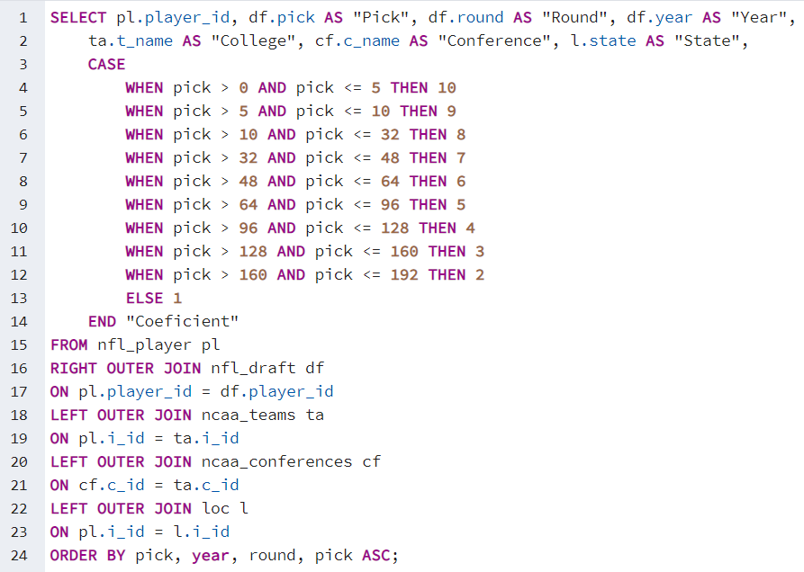

# UT College Football

On July 2021, University of Texas announced that is leaving Big 12 Conference and officially [asked to join SEC](https://www.texastribune.org/2021/07/26/university-texas-big-12/) starting July 2025.

SEC is one the best conferences for college football, so that moves seems like a move to make a better football team, but, is that true? Let's see:

* See Tableau Public Story [UT CollegeFootball Story](https://public.tableau.com/app/profile/luis.ruiz.lopez/viz/UTCollegeFootballStory/Presentation?publish=yes)

### Academics

Analysis of the [ARWU](http://archive.shanghairanking.com/ARWU2020.html) (Academic Ranking of World Universities) of University of Shanghai.
I Choose ARWU ranking because is the most accepted ranking for universities in the world. I'm aware there are more rankings for universities in the US, but this seems like an acceptable choice. There are also rankings by subjects that could be use.

* Conclusions: 

    - UT-Austin is ranked the best university in Texas, followed by Rice University and Baylor College of Medicine. 11 Universities from Texas appeared in the ranking from 2016 to 2015.

    - The Northeast of the Country is the area with more concentration of universities that appear in the ranking. Inside Texas, Houston is the city with more universities in the ranking.

    - Texas is the first state in appearances in the ranking with 42 in the five years period. Followed by Massachussets, 38 and NY 36.

    - California is the State with better coeficient, followed by Texas and NY.

    - Illinois with a median world ranking of 41 and 27 appearances deserve a mention.

    So we can conclude that in according to ARWU ranking for the years 2016 to 2020, California  holds the best position followed by Texas. And, inside Texas, UT-Austin is the best univeristy to study.

### College Football

With that being said, let see how is college football for the UT Longhorns. 

One the most important objetives of college sports is to help players to develop their skills and continue their career as a professional sportman. In the Football case, to analyze the compliance with this objetive one the best options is to analyze how many players from the university team is being picked in each year draft. The hypothesis is that the best is the team, the more players are going to be picked from the team in the draft. 

The second hypothesis is that the best is the academic part of the university, the more and better players would want to join the university team. 

As we can see in the third slide, only 12 players from UT were drafted in the five year period. University of Alabama holds the first position in this ranking with 48 players being drafted in the five years period. 

Regarding Texas universities, Texas A&M holds the best position in the five years period. Both, Texas A&M and University of Alabama plays in the SEC. 

 - With Texas A&M and University of Alabama appearing in ARWU lower than rank 100 in the five years period, we can conclude that my second hypothesis is completely false. There is no a correlation between academic quality and football performance. 

### Draft by States

The University of Alabama surely helps Alabama to hold the first position in the coeficient of players drafted by state. Players from universities in Alabama are drafted in lower picks than player from other states. This is important because Alabama is the third state in count of players drafted with 77. 

Texas is the second state by coeficient but holds the first position in number of players drafted with 95, Florida is the second with 93

The majority of players drafted in Alabama plays in SEC, while in Texas play in Big 12. The first conference in Florida is ACC.

### Conference

One thing a team can do to improve is switch conferences. If you compete against better teams, the games are going to be better, the team is going to gain fans and more high school players would want to play for you. Also, with more people following the team, the players are going to have more exposure to NFL teams and more possibilities to be drafted. 

That could be one of the reasons that moved UT to ask to join SEC. 

- In the five year period, SEC holds the first position in number of players drafted. Big 12 a discrete 5th position.
- For each year, SEC has been the conference with more players drafted.

* Qualitative Analisis. 

- SEC not only holds the best position in players drafted, but also the first in coeficient. That means players from SEC are drafted in better positions. Again, Big 12 holds the 5th position.

- By year, SEC is the best year by year since 2016 with a rising trend. Big 12 trend is mostly flat.

### Conclusion.

- Regarding Academics, UT holds a meritory raking 41st and 30th in Economics. UT is the best University of Texas as well as Texas is the second best state to study in the US.

- However, There is no correlation between academic quality and football performance. 

- UT is the third Texas universities in number of picks on NFL draft for 2016-2020 period.

- Big 12 is the fifth in number of picks for the five years period.

- SEC is the first conference in number of picks for the five year period.

## If finally, UT joins SEC is going to have more chances to improve, more players would want to play in the team and the fan base is going to grow.
- As Admiral McRaven said at UT speech, "If you want to change the world, don't back down from the sharks" UT is going to playing vs the best teams in college league, vs some "sharks", but it is a great move to improve the football team.

### And, that is very good, because we all know that football is big deal in the Lone Star State, So the better is our football team, more options to increase the fundraise we are going to have. More funds means more resources and more resources mean a better university. 

 
 
 
 

# Methodology:

### ETL
* Extract:
    - Sources:
    [ARWU](http://archive.shanghairanking.com/ARWU2020.html)
    [Pro football reference](https://www.pro-football-reference.com/years/2020/draft.htm)
    [National Center for Educational Statistics](https://nces.ed.gov/datatools/index.asp?DataToolSectionID=1)
    [The University of Texas Systeam](https://data.utsystem.edu/)
    - Extract information using Pandas.

* Transform

    - Transform columns, data types, add id's, check the institutions names to make sure everything match. 
    - Pandas.
     

* Load

    - Make ERD (Entity Relationship Diagram) to build a SQL Database. I use [QuickDatabaseDiagram](https://www.quickdatabasediagrams.com/)
 

    - Take in consideration slow moving dimension to design the database.

    - Export and check the SQL script to create the tables in a previously created database. 
    - Load the data into the database. 

 
 

### Query the SQL Database and download the csv files.

* Query to extract the [ARWU ranking data](SQL/QueryRankingUS.sql) joined with the location for the US universities. Also, make a coeficient using Case statement for qualitative analysis.

 

* Query to extract the [NFL draft](SQL/QueryDraft.sql) data joined with college location. Also, make a coeficient using Case statement for qualitative analysis.

 
 

### Load the data to Tableau.

## Notes

- Improvements:
    - Add more years to the database.
    - Add more sports to the database. NBA, Soccer.
    - Add female category
    - Add more categories to the database. Revenue, number of players, stadium capacity.

- Difficulties:
    
    - Find and extract the data
    - Missing values
    - Unmatching names
    - Bias: Every ranking has it bias, it is very difficult to choose one to work with.
    - Draft doesn't show the entire picture of a college team

- Challenges:
    - I had no idea of college sports until 4 years ago.
    - Data could be protected or not available

